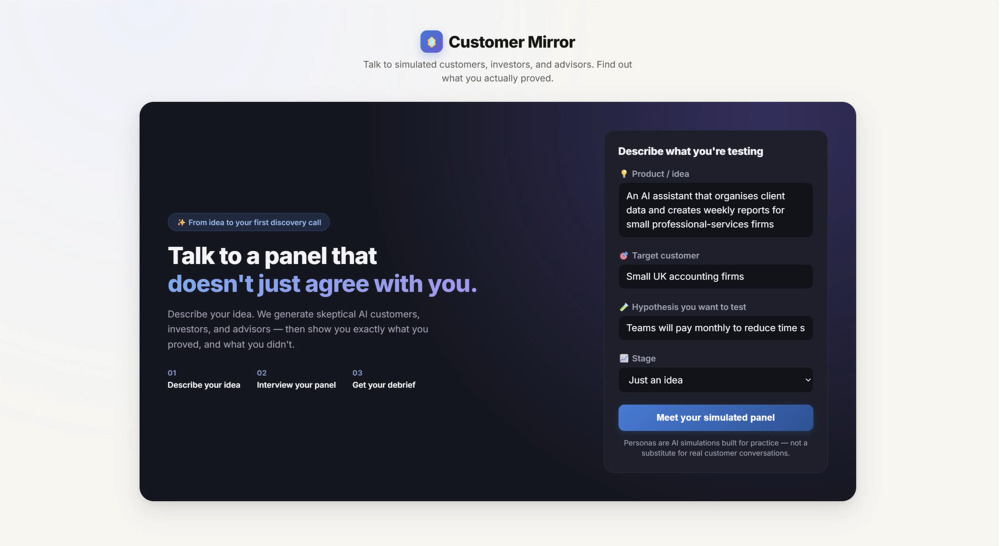
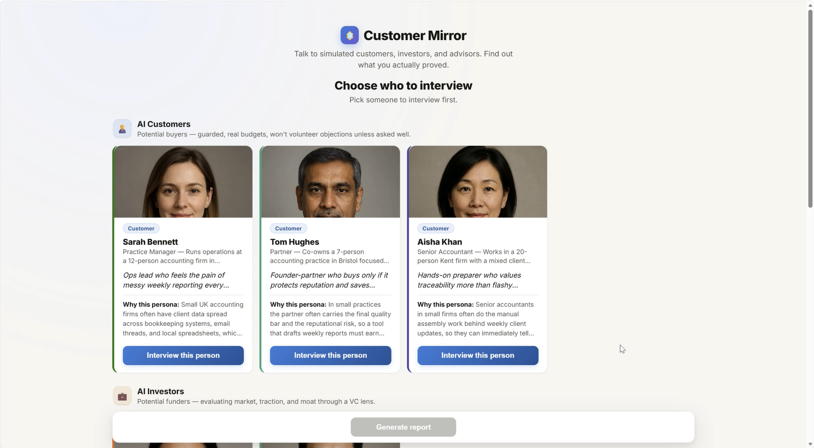
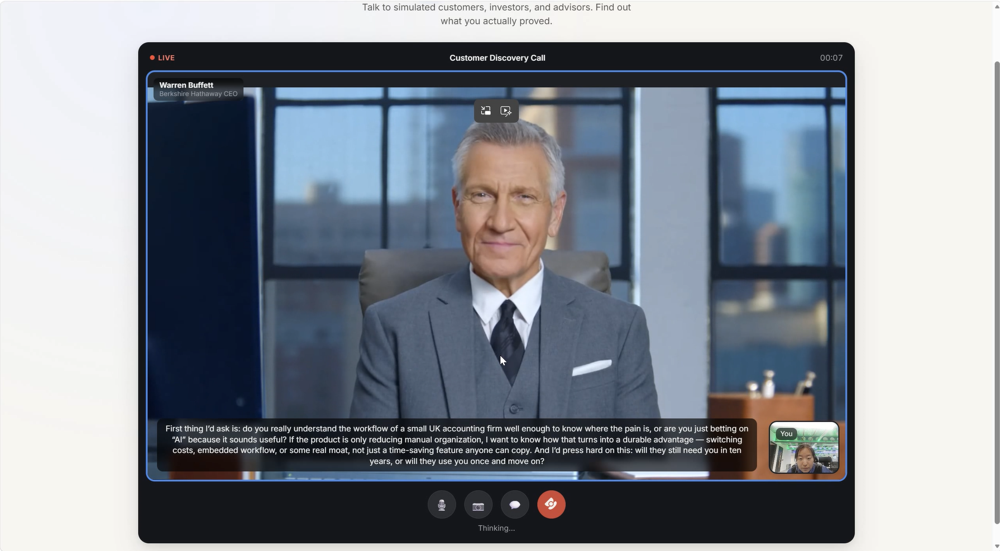
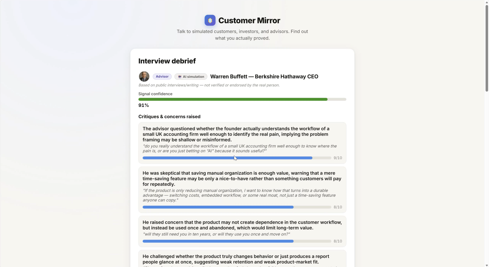

# Customer Mirror

An AI discovery-interview simulator, built for the {Tech: Europe} Agentic AI Hackathon (London, 2026-09-19).

You describe a product idea, a target customer, and the hypothesis you want to test. The system generates a
whole panel of people to interview:

- **AI customers** — potential buyers with real budgets, real objections, and no obligation to volunteer them
- **AI investors** — evaluating your idea through a VC lens (market, traction, moat)
- **An advisor panel** — AI simulations of well-known operators and investors (Tim Cook, Paul Graham, Warren
  Buffett, Reid Hoffman), built from their public interviews and essays. They're proactive and opinionated,
  not guarded — and everywhere in the UI they're clearly labeled as simulations, not real statements from or
  endorsements by the actual people.

You interview whoever you pick, by voice (hands-free) or text. When you're done with one or several of them,
you generate a report: what you actually proved, which questions were leading or hypothetical (Mom Test
style), which ones worked, and what to ask next — downloadable as a PDF.

The point isn't a compliant AI that likes your idea. It's practicing how to get real signal out of guarded,
skeptical people before you spend that credibility on real customers and investors.

## Screenshots

| | |
|---|---|
|  |  |
|  |  |

## How it works

1. Fill in the product brief form.
2. Choose someone from the panel — a customer, an investor, or an advisor — and start talking. In hands-free
   mode you just talk; the app detects when you pause and sends automatically. Try a leading question
   ("wouldn't you pay $30/mo for this?") next to a Mom Test-style one ("what do you use today when this
   problem comes up?") and notice the difference in how guarded the answers are.
3. End that interview, optionally talk to more people from the panel, then generate the report — it covers
   exactly whoever you actually interviewed, with a cross-persona synthesis if you talked to more than one.
4. Reveal any interviewed persona's hidden ground truth to compare it against what you actually uncovered.
5. Download the report as a PDF, or start over with a new idea.

## Architecture

- **Backend**: FastAPI + [Pydantic AI](https://ai.pydantic.dev/) for agent orchestration.
  - `slate_agent` — generates the customer/investor candidate slate for a brief in one structured call
    (`backend/app/agents.py`)
  - a per-turn interview agent, built with a dynamic system prompt per persona type (guarded customer/investor
    vs. proactive advisor) so it won't over-share
  - `coach_agent` — grades a transcript against the persona's secret ground truth, producing a structured
    `InterviewInsight` (leading questions, good questions, confidence, next questions)
  - `synthesis_agent` — a lightweight cross-persona summary when a report covers more than one interview
  - `backend/app/advisors.py` — the fixed advisor roster: hand-curated, grounded in each person's well-documented
    public philosophy, not LLM-invented and not built from private information
- **Models**: all agent outputs are typed Pydantic models (`backend/app/models.py`), so personas and reports are
  always structured, never free text to parse.
- **LLM**: Gemini if `GEMINI_API_KEY` is set, otherwise OpenAI (`backend/app/config.py`). Swappable per-agent
  since every agent just reads `config.LLM_MODEL`.
- **Speech**: OpenAI for both directions — `gpt-4o-mini-transcribe` for speech-to-text, `gpt-4o-mini-tts` for
  the persona's voice (`backend/app/audio.py`).
- **Digital human avatar** (`frontend/app.js`), tried in order per interview:
  1. A free, self-hosted local avatar via [LiveTalking](https://github.com/lipku/LiveTalking) (WebRTC), if
     you're running one on `localhost:8010` — see below.
  2. [LiveAvatar](https://liveavatar.com) (HeyGen), a paid cloud avatar — the backend mints a short-lived
     session token so the API key never reaches the browser (`POST /api/liveavatar/token`).
  3. A built-in animated SVG face with real-time mouth movement driven by the reply audio's waveform — zero
     setup, zero cost, always available.
  Each persona gets a consistent AI-generated (not a real person's) headshot, matched to their gender and
  deduplicated within a session, used both as the candidate-card photo and, where applicable, as the local
  avatar's likeness.
- **Report PDF**: rendered server-side with `fpdf2` (`backend/app/report_pdf.py`).
- **Frontend**: plain HTML/CSS/JS, no build step, served by FastAPI's `StaticFiles`. Hands-free voice uses
  `MediaRecorder` + a Web Audio analyser for silence detection; playback via WebRTC (avatar) or `data:` URI
  (audio fallback).
- **State**: in-memory session store (`backend/app/store.py`) — fine for a demo, not for production.

## Setup

```powershell
cd backend
python -m venv venv          # already done if you're reading this after setup
./venv/Scripts/pip install -r requirements.txt
```

Copy `backend/.env.example` to `backend/.env` and fill in your `OPENAI_API_KEY` (required — it's always used
for speech). Everything else in `.env` is optional; see the comments in `.env.example`.

## Run

```powershell
cd backend
./venv/Scripts/uvicorn app.main:app --reload --port 8000
```

Open http://localhost:8000 — the frontend is served from the same server, so there's no CORS setup needed.

## Optional: free local digital human (LiveTalking)

If you don't configure LiveAvatar (or want to avoid its per-minute cost entirely), you can run
[LiveTalking](https://github.com/lipku/LiveTalking) yourself — it's open source, self-hosted, and the
frontend will use it automatically whenever it's reachable on `http://localhost:8010`. Requires an NVIDIA
GPU. Clone it, follow its README to download the wav2lip model weights, and start it with:

```bash
python app.py --transport webrtc --model wav2lip --avatar_id <your-avatar-id>
```

You can create additional avatar likenesses (e.g. from AI-generated, non-real-person headshots) via
LiveTalking's `/api/avatar/task` endpoint — see its `docs/avatar_api.md`.

## Notes

- Sessions are in-memory and reset when the server restarts.
- Voice recording requires mic permission in the browser and works best over `localhost` or HTTPS.
- The advisor panel simulates public figures' well-documented thinking style for brainstorming purposes only
  — it is not them, does not use their likeness for the avatar, and should never be mistaken for their real
  views.
- Swap `LLM_MODEL`/`GEMINI_MODEL`/`TTS_MODEL`/`STT_MODEL` in `backend/.env` if you want different models.
